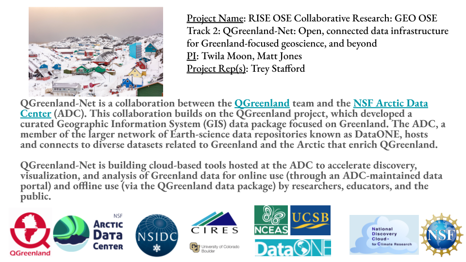

The National Discovery Cloud for Climate (NDC-C) workshop took place from March
6-8, 2024 in San Diego, CA. Trey Stafford attended the workshop on behalf of the
QGreenland-Net project.

Per the [workshop website](https://www.nationaldiscoverycloud.org/home):

> The National Science Foundation (NSF) initiated the development of a National
> Discovery Cloud for Climate (NDC-C) to “federate advanced compute, data,
> software, and networking resources, democratizing access to a
> cyberinfrastructure ecosystem that is increasingly necessary to further
> climate-related science and engineering”. The NDC-C builds on many existing
> efforts supported by the CISE and GEO directorates across the entire science
> vertical from hardware to foundational infrastructure to software services to
> core climate research to community activities.

There were ~30 projects represented, ranging from infrastructure work (e.g., new
HPC resources) to research projects focused on answering earth-science questions
using cloud-computing resources (e.g., permafrost landscape analysis in the
Arctic). Discussions ranged from long-term visions of a cloud-based
computational environment that users interact with through AI natural-language
interfaces to what we can do as a disparate group of individually-funded
projects in the next 6-18 months.

The NDC-C is a 2-year pilot that aims to lay the foundations for an NDC that
will cater to a wider science community.

There were many discussions about AI, and comparisons between the NDC-C and the
[National Artificial Intelligence Research Resource
Pilot](https://new.nsf.gov/focus-areas/artificial-intelligence/nairr) were
highlighted by the NSF reps in attendance.

Two NSF representatives were present at the meeting, [Marlon
Pierce](https://www.nsf.gov/staff/staff_bio.jsp?lan=mpierce&org=OAC&from_org=OAC)
(CISE program director), and [Amy
L. Walton](https://www.nsf.gov/staff/staff_bio.jsp?lan=awalton&from_org=CISE)
(CISE Deputy Office Director).

## Workshop activities

The workshop utilized the [collective
impact](https://collectiveimpactforum.org/what-is-collective-impact/)
framework. Collective impact focuses on identifying and setting shared
goals/objectives, defining measures for success, and emphasizing
collaborations. Collective impact also places importance on defining a
"backbone" organization/team that will help to align and coordinate group work.

The workshop was comprised of guided discussions, breakout groups, and
networking/collaboration time.

### Guided Discussions

There were two guided discussions facilitated by the workshop organizers:

* A conversation with Elizabeth Simmons, Executive Vice Chancellor, UC San
  Diego, about how the collective impact framework has been successfully
  utilized by UC San Diego.

* A panel discussion about equity and education in climate research. Panelists
  were:
  * Olivia Graeve, professor at UC San Diego
  * Dr. Maureen A. Guarcello, director of program evaluation at San Diego State
    University
  * Leah Kraus, Secretary of the Minorty Serving Cyberinfrastructure Consortium
    (MS-CC)

### Breakout groups

Breakout groups were utilized for focused discussions on topics guided by the
collective impact framework and goals of the NDC-C. Breakout groups included discussions on:

* Setting a common agenda, guiding priciples, and goals for the NDC-C.
* Establishing a shared system of measuring succcess/failure.
* Defining mutually reinforcing activities & identifying areas of collaboration.
* Identifying mechanisms for continous communication between NDC-C stakeholders.
* Brainstorming the establishment of a "backbone support organization". For
  example, conversations about the development of an NSF community office that
  would coordinate NDC-C activities were discussed in this breakout session.

### Networking & collaboration

The workshop organizers emphasized networking and establishing collaborations
between projects. These collaborations were highlighted as examples of how
individual projects could work together and build upon successes to
have collectively broader impacts.

Collaborations that I explored while attending the conference included:

* Lakshmi Subramanian and Ankit Bhardwaj of the [EAGER: Scalable Climate
  Modeling using Message-Passing Recurrent Neural
  Networks](https://www.nsf.gov/awardsearch/showAward?AWD_ID=2335773) project
  are working on AI models that could be leveraged by QGreenland-Net to
  suggest/automate the creation of data transformation workflows.
* Joanmarie DelVecchio of the [Elements: A workflow for efficient and
  reproducible permafrost geomorphology
  analysis](https://www.nsf.gov/awardsearch/showAward?AWD_ID=2311319) project is
  interested in using the tools we develop to find and extract data of
  contextual importance to study sites in Greenland.
* [Pelican: Advancing the Open Science Data Federation
  Platform](https://www.nsf.gov/awardsearch/showAward?AWD_ID=2331480)
* Pedro Ramonetti Vega and Sergey Gurvich of the [National Data Platform Pilot:
  Services for Equitable Open Access to
  Data](https://www.nsf.gov/awardsearch/showAward?AWD_ID=2333609) project spoke
  with me about the possibility of connecting the ADC/DataOne to the National
  Data Platform, which provides AI tools to support data discoverability.

### Workshop outcomes

#### Workshop report

At the conclusion of the workshop, a report was drafted. As of April 3, 2024,
the report has yet to be published. Once published, I would expect it to be
linked to on the [NDC-C workshop
website](https://www.nationaldiscoverycloud.org/home).

#### Project slides

Each project contributed at least one page/slide describing the project for
non-collaborators. The NSF representatives planned to use these slides in
discussions with their peers at the NSF.

#### Actual and potential collaborations

The workshop organizers collected a list of all actual and potential
collaborations. What collaborations we end up engaging with (if any) are up to
us to make. There may be funding opportunities for supporting collaborations in
the future.

# Resources

* [NDC-C NSF website](https://new.nsf.gov/cise/national-discovery-cloud-climate)
* [NDC-C workshop website](https://www.nationaldiscoverycloud.org/home)
* [NDC-C workshop overview slides](/presentations/ndcc-overview.md)
* [Photos from Trey's trip](https://photos.app.goo.gl/gvmBJu3agig49BtAA)
