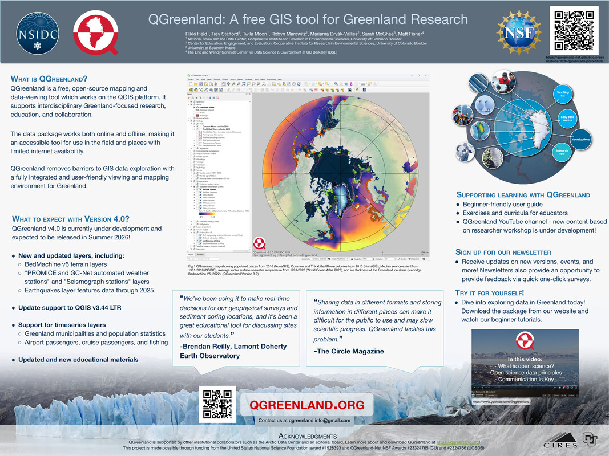

## Welcome!

This page is for people interested in learning more about the QGreenland team's
"QGreenland: A free GIS tool for Greenland Research" poster presented at the
[Colorado Glaciology
Workshop](https://www.igsoc.org/event/colorado-glaciology-workshop) on April
24th, 2026 and the [2026 CIRES
Rendezvous](https://ciresevents.colorado.edu/rendezvous/) under the "Data
(management, analysis, visualization, science and assimilation)" theme.

To learn more about QGreenland and download the QGreenland data package, visit
our website at [qgreenland.org](https://qgreenland.org)!

## Abstract

Accessing and interacting with interdisciplinary geospatial datasets is an
ongoing challenge in the Earth Science community. QGreenland addresses this gap
as a free, open-source mapping and data-viewing tool for Greenland, which works
on the QGIS platform. By compiling diverse Greenland-focused datasets into an
integrated GIS data package, QGreenland supports researchers and educators and
promotes collaboration among the geoscience community and other interested
groups.

Since 2019, QGreenland has been used by researchers and educators to plan field
work, share maps and geospatial datasets, develop proposals and visuals, teach
about Greenland and GIS, and has provided a foundational data environment for
integrating new data. A variety of educational materials including the
QGreenland website, user guide, and video tutorials make this data environment
accessible for all user levels.

This poster provides an overview of QGreenland and highlights work on the
upcoming v4 data package. V4 is expected to be released in 2026 and will include
new and updated layers, improved support for QGIS v3.44 LTR, support for
timeseries layers, and updated educational materials. Alpha releases are already
underway and we welcome user engagement.

## Poster

{fig-align="center"}

## Learn more!

* [QGreenland official site](https://qgreenland.org): learn about QGreenland, download the data package, and find teaching resources
* [QGreenland on YouTube](https://www.youtube.com/@qgreenland): find tutorial videos, workshop recordings, and more!

## About the team

* [Rikki Held](https://www.linkedin.com/in/rikki-held-1b139b204/)
* [Trey Stafford](https://cires.colorado.edu/people/trey-stafford) | [GitHub](https://github.com/trey-stafford)
* [Twila Moon](https://nsidc.org/about/about-nsidc/what-we-do/our-people/twila_moon)
* [Robyn Marowitz](https://cires.colorado.edu/people/robyn-marowitz) | [GitHub](https://github.com/rmarow)
* [Mariama Dryák-Vallies](https://ceee.colorado.edu/people/mariama-dryak-vallies)
* Sarah McGhee is a student at the University of Southern Maine
* [Matt Fisher](https://mfisher87.github.io) | [GitHub](https://github.com/mfisher87)
