## Meet the team

<table>
  <tr>
    <td align="center">
      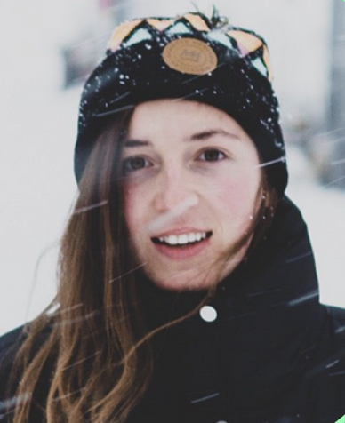 
      <b>Alyona (ADC)</b>
    </td>
    <td align="center">
      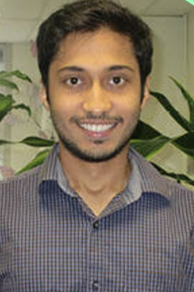 
      <b>Rushiraj (ADC)</b>
    </td>
  </tr>
  <tr>
    <td align="center">
       
      <b>Robyn (NSIDC)</b>
    </td>
    <td align="center">
      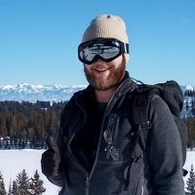 
      <b>Trey (NSIDC)</b>
    </td>
  </tr>
</table>

## Open Geospatioal Data Cloud

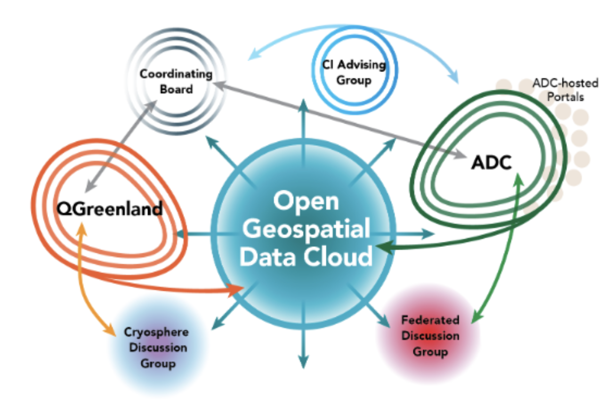

## High Level OGDC Overview

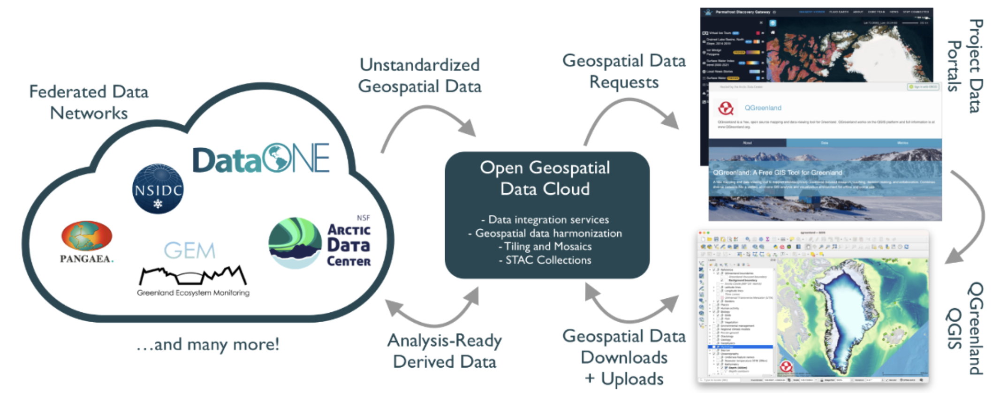

## Argo Workflow Enginer

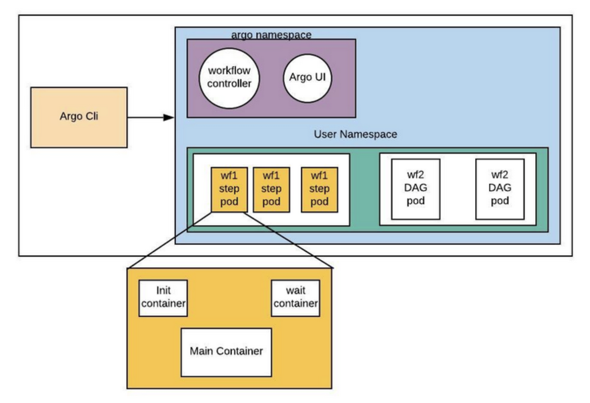

## Handling workflows with Argo and K8s

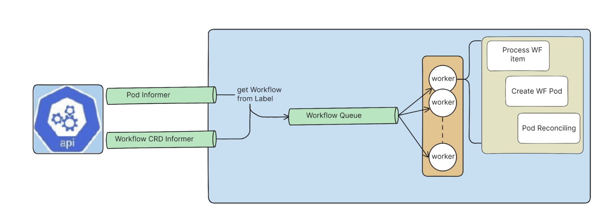

## OGDC Architecture

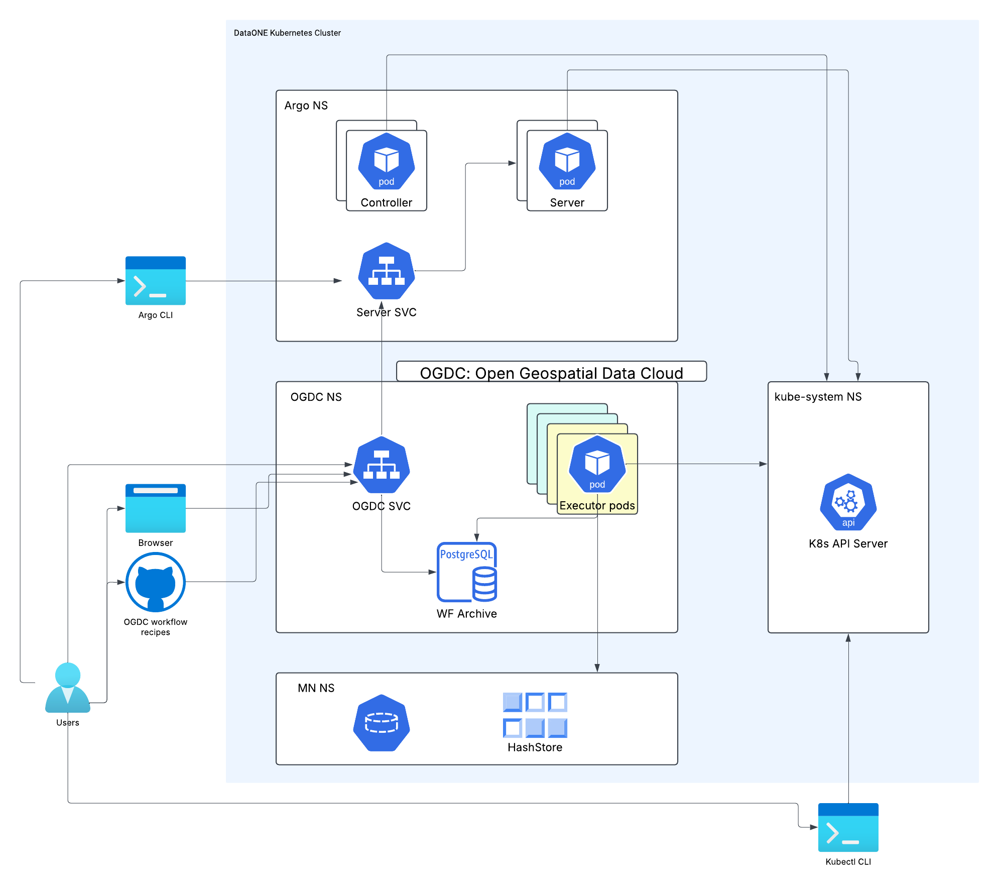

## OGDC Recipes

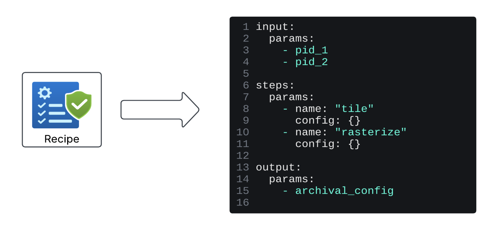

## Worfkflows with Argo

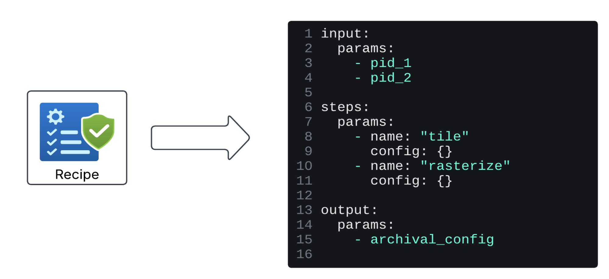

## Hera Python SDK

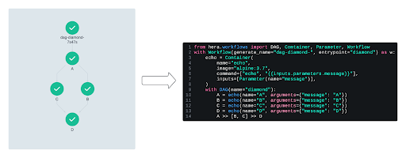

## Scaling Viz workflow

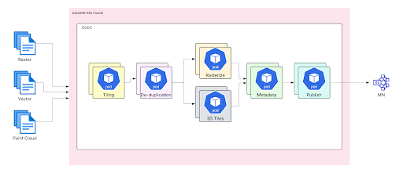

## Tiling Workflow

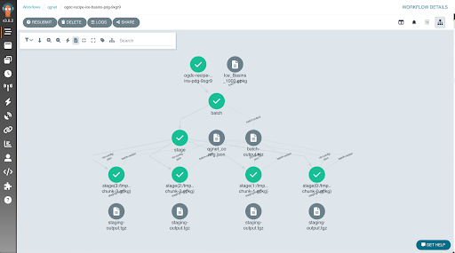
