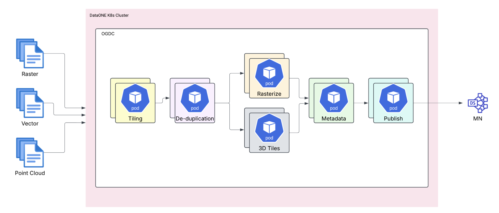
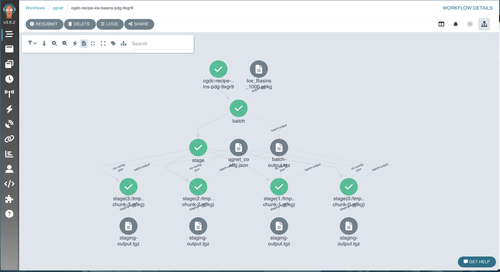

## Meet the team

<table>
  <tr>
    <td align="center">
       
      <b>Alyona</b>
    </td>
    <td align="center">
       
      <b>Rushiraj</b>
    </td>
  </tr>
  <tr>
    <td align="center">
       
      <b>Robyn (NSIDC)</b>
    </td>
    <td align="center">
       
      <b>Trey (NSIDC)</b>
    </td>
  </tr>
</table>

## Open Geospatioal Data Cloud

::: {.notes}
An initiative to manage and process geospatial data effective.
:::

## High Level OGDC Overview

## Argo Workflow Engine

::: {.notes}
A tool for orchestrating parallel tasks on Kubernetes, facilitating the management of complex workflows.
:::

## Handling workflows with Argo and K8s

::: {.notes}
Integration of Argo with Kubernetes to streamline workflow automation and scalability.
:::

## OGDC Architecture

## OGDC Recipes

::: {.notes}
Standardized procedures or scripts used within the OGDC to process and analyze geospatial data.
:::

## Worfkflows with Argo

::: {.notes}
Implementation of Argo to define, execute, and monitor workflows within the OGDC framework. Used in the ogdc-runner repository.
:::

## Hera Python SDK

::: {.notes}
A Python Software Development Kit designed to interact with Argo Workflows, simplifying the creation and management of workflows programmatically.
:::

## Scaling Viz workflow

## Tiling Workflow

## Thank you!
