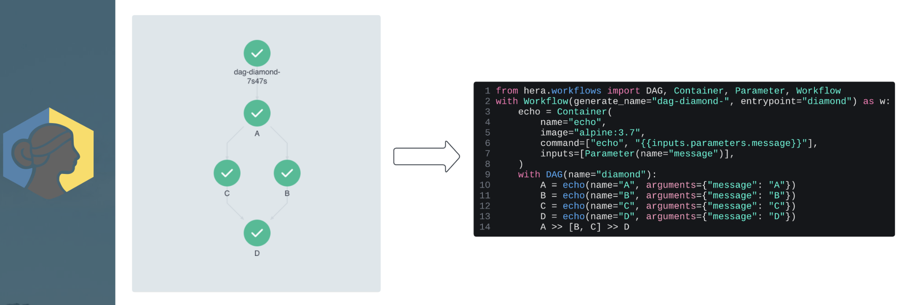

## Meet the team

## Open Geospatioal Data Cloud

## High Level OGDC Overview

## Argo Workflow Enginer

## Handling workflows with Argo and K8s

# # OGDC Architecture

# OGDC Recipes

## Worfkflows with Argo

## Hera Python SDK

## Scaling Viz workflow

