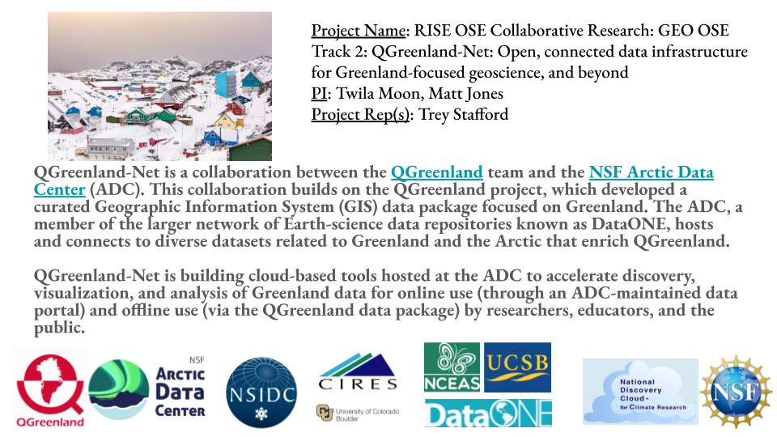

## Workshop overview

* San Diego, CA March 6-7, 2024
* Focus on defining NSF vision for cloud-based climate science
* Similarities to [National Artificial Intelligence Research Resource Pilot
  (NAIRR)](https://new.nsf.gov/focus-areas/artificial-intelligence/nairr)
* ~30 projects represented
* Mostly PIs in attendance
* Trey represented the QGreenland-Net project

::: {.notes}
Workshop focused on defining a vision for the NSF's activities supporting the creation of a more integrated cloud-based system for climate science
:::

# 

::: {.notes}
This image of a slide was created for the workshop. The 
:::

# Workshop activitites

* Breakout groups
* Panel discussions
  * Collective impact
  * Equity and education
* Networking/collaboration time

# Workshop outcomes

* Reccomendations for the NSF NDC-C via a workshop report
* Slides describing each  project
* Establishment of actual and potential collaborations 

# Collaborations explored

* [EAGER: Scalable Climate Modeling using Message-Passing Recurrent Neural Networks](https://www.nsf.gov/awardsearch/showAward?AWD_ID=2335773)
* [Elements: A workflow for efficient and reproducible permafrost geomorphology analysis](https://www.nsf.gov/awardsearch/showAward?AWD_ID=2311319)
* [Pelican: Advancing the Open Science Data Federation Platform](https://www.nsf.gov/awardsearch/showAward?AWD_ID=2331480)
* [National Data Platform Pilot: Services for Equitable Open Access to Data](https://www.nsf.gov/awardsearch/showAward?AWD_ID=2333609)

::: {.notes}
* "EAGER: Scalable Climate Modeling using Message-Passing Recurrent Neural Networks" project are working on AI models that could be leveraged by QGreenland-Net to suggest/automate the creation of data transformation workflows.
* "Elements: A workflow for efficient and reproducible permafrost geomorphology analysis" project is interested in using the tools we develop to find and extract data of contextual importance to study sites in Greenland
* "Pelican: Advancing the Open Science Data Federation Platform" project and I spoke about potentially adding QGreenland data to the Open Science Data Federation Platform (OSDF), which provides cloud-friendly access to science data via a global network of data caches.
* "National Data Platform Pilot: Services for Equitable Open Access to Data" project spoke with me about the possibility of connecting the ADC/DataOne to the National Data Platform, which provides AI tools to support data discoverability.
:::

# Resources

* [NDC-C NSF website](https://new.nsf.gov/cise/national-discovery-cloud-climate)
* [NDC-C workshop website](https://www.nationaldiscoverycloud.org/home)
* [QGreenland-Net info/planning website](https://qgreenland-net.github.io/)
